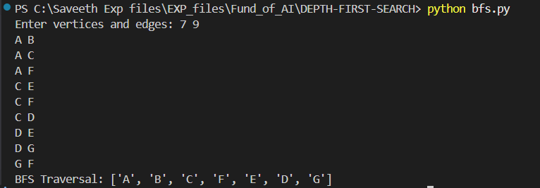
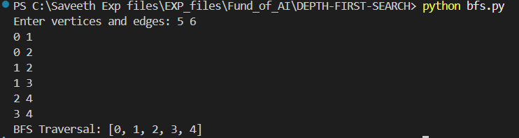

# Breadth-First Search (BFS)  

## Exp No 3: Implement Breadth First Search Traversal of a Graph  

**Name:**  
**Register Number:**  

### Aim
To implement Breadth First Search Traversal of a Graph using Python 3.  

---

### Theory
Breadth-First Traversal (or Search) for a graph is similar to the Breadth-First Traversal of a tree.  
Unlike trees, graphs may contain cycles, so a node may be visited more than once. To avoid this, vertices are categorized as:  

1. **Visited**  
2. **Not Visited**  

A Boolean `visited` array is used to mark visited vertices. BFS uses a **queue** data structure for traversal.  

**How BFS works:**  
Starting from the root, all nodes at a particular level are visited first, then the next level nodes are traversed until all nodes are visited.  
All the adjacent unvisited nodes of the current node are pushed into the queue, and the current node is marked as visited and popped from the queue.  

**Illustration:**  
1. Initially, the queue and visited array are empty.  
2. Push node 0 into the queue and mark it visited.  
3. Remove node 0 from the front of the queue, visit unvisited neighbours, and push them into the queue.  
4. Repeat this process for all nodes until the queue is empty.  

---

### Algorithm
1. Construct a Graph with Nodes and Edges.  
2. Use a Queue to perform BFS traversal.  
3. Insert a Start Node into the Queue.  
4. Find its successors or neighbors and check if they are visited.  
5. If not visited, add them to the Queue. Otherwise, continue.  
6. Repeat steps 4-5 until all nodes are visited.  

---

### Sample Input 1
7 9
A B
A C
A F
C E
C F
C D
D E
D G
G F

### Sample Output 1
['A', 'B', 'C', 'F', 'E', 'D', 'G']

---

### Sample Input 2

5 6
0 1
0 2
1 2
1 3
2 4
3 4

### Sample Output 2

['0', '1', '2', '3', '4']


---
### Program
```py

from collections import deque, defaultdict

def bfs(graph, start, visited, path):
    queue = deque()
    path.append(start)
    queue.append(start)
    visited[start] = True

    while queue:
        tmpnode = queue.popleft()
        for neighbour in graph[tmpnode]:
            if not visited[neighbour]:
                path.append(neighbour)
                queue.append(neighbour)
                visited[neighbour] = True
    return path


graph = defaultdict(list)
v, e = map(int, input("Enter vertices and edges: ").split())

# Check if vertices are integers or characters
is_integer_graph = None

for _ in range(e):
    u, v = input().split()
    # Detect type on first edge
    if is_integer_graph is None:
        is_integer_graph = u.isdigit()
    # Convert to int if integer graph
    if is_integer_graph:
        u, v = int(u), int(v)
    graph[u].append(v)
    graph[v].append(u)

# Choose start automatically
if is_integer_graph:
    start = 0
else:
    start = 'A'

path = []
visited = defaultdict(bool)
traversedpath = bfs(graph, start, visited, path)
print("BFS Traversal:", traversedpath)

```
### Output



### Result
Thus, a graph was constructed and BFS traversal for the graph was implemented successfully